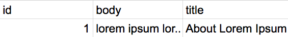
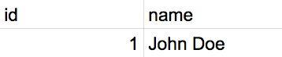
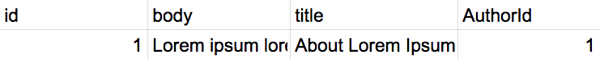
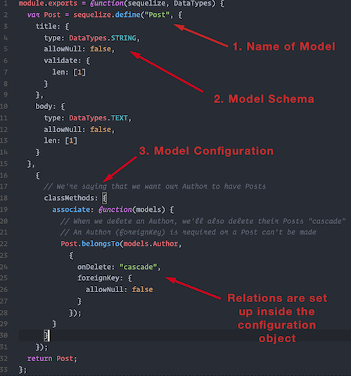
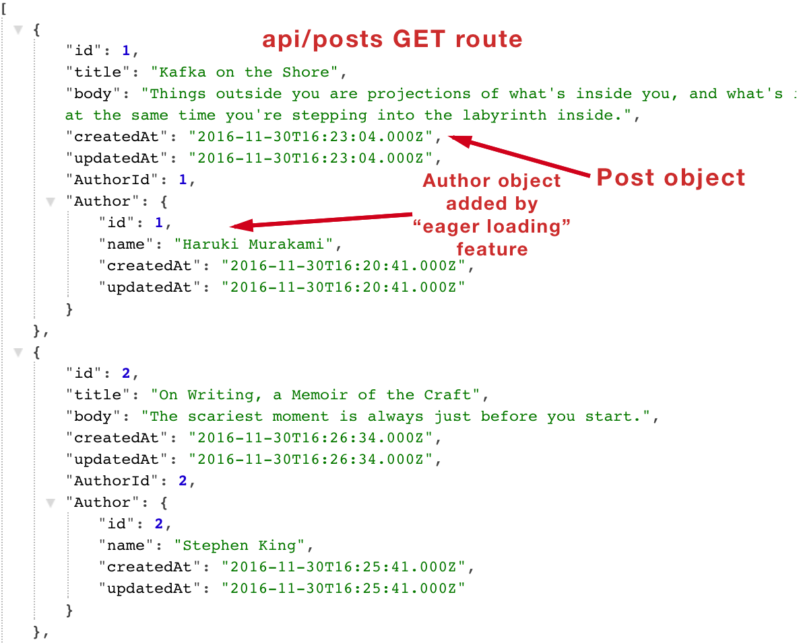
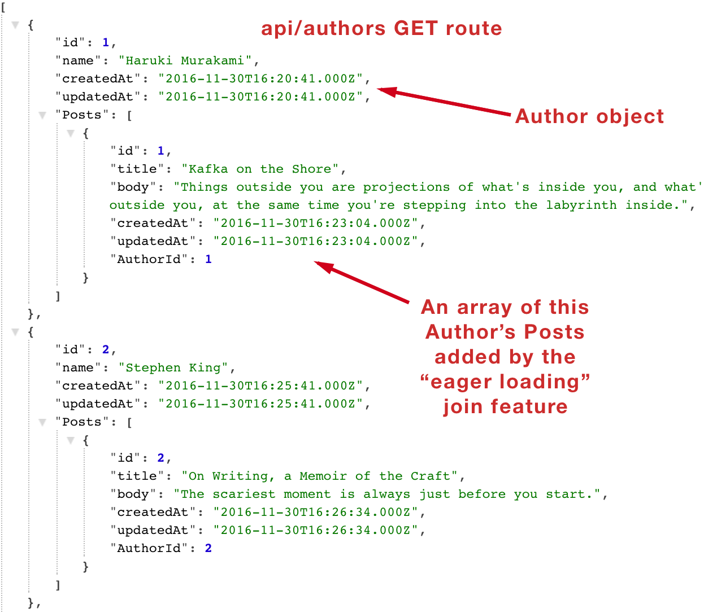

## 15.3 Lesson Plan - Getting Associated with Relations

### Overview
In today's class we'll reinforce the concepts we went over in the last class including CRUD actions, and passing in options into our queries, such as the "where" query attribute. We will also introduce the concept of relations in Sequelize.

##### Instructor Priorities:

* Students should feel more comfortable with model creation in Sequelize.
* Students should feel more comfortable performing each CRUD action using Sequelize.
* Students should become familiar with relations in Sequelize.
* Students should become familiar with the "include" option in order to easily perform queries with joins.

##### Instructor Notes:

* Let students know that this has historically always been one of the most challenging weeks of the course. Give them praise for making it to Sequelize Day 3.

* Let students know that we're going to go over some unfamiliar syntax today. There will be a good amount of going through the Sequelize docs, though we'll save them some time and trouble by pointing them in the right direction.

* Be sure to look at the solutions to each activity before the lecture begins, and to run the server files in each folder to see how they should run. There's a lot to do today, so the more prep time you can give yourself, the better.

* Make sure you have a MYSQL database named "blogger" created on your machine before class starts.

* Odds are some students will finish activities very early, while others will struggle with some of the new syntax introduced. Have these students work together if possible for the group activities.

* Throughout class, stress to students that today will be all back-end coding. The exercises are all built in a way where they don't need to modify any client side code in order to better focus on Sequelize.

-------

### Class Objectives

* To reinforce the concepts covered in the first 2 days, primarily CRUD and model creation with Sequelize.

* To introduce the concept of relations using Sequelize.

* To introduce the "include" option for performing joins with our queries.

* To get students used to looking through Sequelize's documentation for answers to specific questions.

* Students will create a blog app with a content management system that can be used to update it's data.

--------

### 0. Instructor Do: Welcome Students (1 min).
* Say your hellos and welcome your class.

----------

### 1. Instructor Do: Pulse Check and Sequelize Review (15 min)
* Once again ask students how the week has been, and what they think of Sequelize.

* Ask students what we went over in the last class.
	* What CRUD methods did we learn? Ask students to briefly try and name as many as they can.
		* `findOne`: finds a single record from a table
		* `findAll`: finds all records from a table
		* `create`: creates a new record in a table
		* `update`: updates a record or records in a table
		* `destroy`: deletes a record or records from a table

	* What does "where" do? What might we use it for?
		* It's an object we can pass in to a Sequelize query. It lets us be more specific about which records we want to target.

	* What are validations and flags?
		* Optional built in Sequelize helpers that let us do things like set up default values for columns, or make sure text is within a certain length before inserting it.

----------

### 2. Instructor Do: Demo App (10 mins)

* **Before demonstrating the app, make sure you update the `config.json` file in the `config` folder to match your own MYSQL database.**

* Open and run the [`2-Blog-CRUD-Solved`](Activities/2-Blog-CRUD/2-Blog-CRUD-Solved) folder inside `Activities/2-Blog-CRUD/`. Navigate to `localhost:8080` and explain to your students that they will be setting up much of the back-end for this blogging Content Management System app. Show students how we can create posts, delete posts, and edit posts. Additionally we can select which categories of posts we want to see by using the drop down on the blog page.

* Answer any questions about the desired functionality of this app before the exercise begins, but try not to get too off topic. There's no need to worry about the front end code at all, and we'll just be creating the post model in this first activity.

----------

### 3. Warm Up: Create a Post Model (15 mins)
Slack out the following folder and instructions:

 - **Folder**: [`1-Post-Model-Unsolved`](Activities/1-Post-Model/1-Post-Model-Unsolved)

**INSTRUCTIONS**:

1) Open the folder slacked out to you, run `npm install`

2) Create a new MYSQL database and name it `blogger`. Don't create any tables.

3) Open the `config` folder and update the `config.json` file's `development` object to match your own local MYSQL database.

4) Go to the `models` folder and open the `post.js` file.

5) Create a Sequelize `Post` model here. The model should have a title property of type DataTypes.STRING, a body property of DataTypes.TEXT, and a category property of DataTypes.STRING. 
(http://docs.sequelizejs.com/en/v3/api/datatypes/)

6) To check if this worked, run `node server` in your terminal. Then open MYSQL Workbench to check if a Posts table has been created.

**Note**: We still have some code to add in the next exercise to get this app fully functioning, just concentrate on creating the Post model and verifying that you were successful for now.

**BONUS**

If you complete the activity before time's up, try adding the following:

1) Flags to the title and body to prevent NULL values from being entered.

2) A validation to the title so that it must be between 1 and 160 characters.

3) A validation to the body so that it must be at least 1 character long.

4) A flag to the category so that it has a default value of "Personal" if a value is not supplied.

----------

### 4. Instructor Do: Review the Post Model Activity (10 mins)
* When time's up, load up the solved version of the folder on your machine ([`1-Post-Model-Solved`](Activities/1-Post-Model/1-Post-Model-Solved)).
	* Be sure to show students the `config.json` file and how you updated it to match you local MYSQL database.

	* Show students the `post.js` file and walk through each part of the code, have students try and explain what each piece is doing.
	  * Go over the validations and flags, but inform students not to worry if they didn't have time for the bonus. It's more important to understand creating models first.

* Start the server and show students how a Posts table is created for us in MYSQL Workbench.

* Answer any remaining questions, if there are none, ask the class:
	* What is the difference between DataTypes.STRING and DataTypes.TEXT?
	
		* STRING is the equivalent of varchar (255) in MYSQL. Useful for storing relatively small values.
		
		* TEXT is a virtually unlimited amount of storage for characters. We might use this if we needed to store something larger or of unknown size.
		
		* This isn't something they need to memorize, a quick search of `Sequelize Data Types` will bring this right up.

* Navigate to the `server.js` file and point out the section of code where we sync our database.

	* Point out the `{ force: true }` object inside of the sync method.
	
		* It says that whenever we sync our database (whenever we start our app), we want to drop our tables and recreate them. This is useful during the development process when we're experimenting with our database structure. During today's activities we'll be changing our models quite a bit, so this is useful to have. We'd want to remove this before deploying to a production environment. (otherwise we'd lose all of our data whenever our app starts)

----------

### 5. Instructor Do: Introduce CRUD Activity (5 mins)

* Open the [`2-Blog-CRUD-Solved`](Activities/2-Blog-CRUD/2-Blog-CRUD-Solved) folder inside of `Activities/2-Blog-CRUD/2-Blog-CRUD-Solved)` and start the server.

* Demonstrate to students again how in the solved copy we're able to retrieve all posts, retrieve posts of a certain category, create new posts, update posts, and delete posts.

* Inform students that now they'll be setting up additional back-end functionality for this code inside of the `api-routes.js` file.

* Again, stress that they won't need to (and shouldn't) modify any of the client side code to make this work.

----------

### 6. Partners Do: CRUD Activity (20 mins)
Slack out the following folder and instructions:

 - **Folder**: [`Blog-CRUD-Unsolved`](Activities/2-Blog-CRUD/2-Blog-CRUD-Unsolved)

**INSTRUCTIONS**:

1) Open the folder slacked out to you, run `npm install`

2) Open the `config` folder and update the `config.json` file's `development` object to match your own local MYSQL database.

3) Navigate to the `api-routes.js` file inside of the `routes` folder.

3) Fill in each route with the code described in the comments to add each CRUD action.

* We can test our code works by checking to see if we have the following functionality (recommended order):

	* Create a new post
	* Get a list of all posts
	* Get a list of all posts of a category
	* Edit a post
	* Delete a post

If things aren't working as expected, check to see if any errors were logged to the terminal.

----------

### 7. Everyone Do: Review the CRUD activity (15 mins)

* If any students were able to complete the entire activity, try and have a volunteer to come up and demonstrate their solution to the class if possible. Otherwise go through the solution in [`2-Blog-CRUD-Solved`](Activities/2-Blog-CRUD/2-Blog-CRUD-Solved) together.

* Answer any remaining questions about the solution. Feel free to spend more time reviewing this activity if necessary. 

----------
### 8. Instructor Do: Demo Post Author Relationships (15 mins)
* Open the ['4-Post-Author-Joins-Solved'](Activities/4-Post-Author-Joins/4-Post-Author-Joins-Solved) application in Chrome and demonstrate how the app's functionality has changed some.

	* We've gotten rid of categories, but now we have the concept of Authors who have Posts, where Posts belong to Authors.

	* Demonstrate how when we first start the app and try and create a new post, we're directed to the `author-manager.html` page, where we must first create an Author.

	* Demonstrate how after creating an Author, we now have the option to create a new Post for that Author.

	* After creating a new Post, we are redirected to the blog page where we see the Author's name by that Post.

	* After creating a few Authors with Posts, navigate to `localhost:8080/api/posts` to show students what the data returned fro the API looks like now. Each Post has a nested Author object. This lets us easily grab information about the Author who wrote the post with very little work.

* Answer any questions about the app's functionality here, or why we might want to include the Author with a Post object when doing a GET request. We're going to talk about how we can restructure our models and queries to make this happen over the next few exercises.

----------

### 9. Partners Do: Discuss Relations (5 mins)

Slack out the following image and have students discuss with their partners.

**Image**: [`3-Relationship-Exercise`](Images/3-Relationship-Exercise.png)

* How can we restructure our database tables if we wanted the ability to form a relationship between a Post and an Author? 

Post

Author

* What would we have to change with these models to make that possible?
	* Which table would have a foreign key and why?
	* What would that look like?

* Remember, an Author can and will have multiple Posts, but a Post will only have a single Author.

----------

### 10. Everyone Do: Discuss Relations (5 mins)
* As a class discuss together the previous exercise.

* Have any volunteers explain their solutions to the class.

* We should have a foreign key on the Posts table because:
	* It would allow us to have multiple Posts all pointing to the same Author.
	* We could make the foreign key a NOT NULL column. This way we could restrict a Post's creation if there is no Author.

Open or slack out the following image to illustrate what this might look like:

----------

## BREAK (40 mins)

----------

### 11. Instructor Do: Introduce Sequelize Associations (5 mins)

* Explain to the class that what we went over in the last activity is considered both a `belongsTo` association, as well as a `hasMany` association in Sequelize. This is one of the most common types of associations.
	* A Post **belongsTo** an Author.
	* An Author **hasMany** posts.

* This may be confusing at first, so we're going to do an exercise to hopefully help make this more clear. This exercise will have some unfamiliar syntax, so instructors and TA's should be walking around offering assistance.

----------

### 12. Groups Do: Sequelize Associations (25 mins)

* Slack out the following folder and instructions:

	* Folder: [`3-Post-Author-Association-Unsolved`](Activities/3-Post-Author-Association/3-Post-Author-Association-Unsolved)

**INSTRUCTIONS**:

1) Open the folder slacked out to you.

2) Run `npm install`

3) Open the `config` folder and update the `config.json` file's `development` object to match your own local MYSQL database.

4) Navigate to the `post.js` file.

5) You will need to pass in a configuration object as a third argument in `sequelize.define` method in order to set up a relation. There's a perfect example of this being done with a **belongsTo** association (part of which you can almost copy exactly) being done here: 
http://docs.sequelizejs.com/en/1.7.0/articles/express/#modelstaskjs

* This may take a few tries to implement correctly in your own Post model (There's a lot of curly braces there!). You can verify your code works by starting your node server and then checking MYSQL Workbench. If the Posts table now has a foreign key of AuthorId, you were successful.

**Bonus**: If you complete the exercise before time's up, navigate to the author.js file and add a **hasMany** association from the Author model to the Post Model. A perfect example can be found here: 
http://docs.sequelizejs.com/en/1.7.0/articles/express/#modelsuserjs

**Note** After this activity we have just one more step to complete the app and get it fully functioning.

----------

### 13. Instructor Do: Review Sequelize Associations (20 mins)

* Open the solved version of the previous exercise ([`3-Post-Author-Association-Solved`](Activities/3-Post-Author-Association/3-Post-Author-Association-Solved)) in Sublime and navigate to the posts.js file.

* Explain to the class that this while this may be some unfamiliar syntax, we don't need to perfectly understand how it all works to use it. But just to break it down one time:

* We pass in an object as a third argument in the sequelize.define method
* This object is used for any additional configuration we want to give our models. Associations fall under this category.
* The object's only key is `classMethods` and it's value is another object.
* This inner object has a key of `associate`.
* `associate` is a function which takes in all of our `models` as an argument.
* We run the **belongsTo** method on Posts and take in models.Author as an argument.
* Optionally, we can pass in an object with additional configuration to the belongsTo method.
* onDelete: "cascade" means that when an Author who owns this post is deleted, our Post will be deleted as well.
* Lastly we're adding a flag to our foreign key (AuthorId) saying this cannot be null. In other words, it won't let us create a Post without an Author.

* **Explain that for the most part they can create an association just by copying and pasting this code. There's no need to worry about memorizing it.**

* Briefly go over the hasMany association in the Author model. This isn't required to put a foreign key on the Post model, but it helps us easily perform joins whether we're doing a find on Posts, or a find on Authors. 

* There are many other types of associations we can do with Sequelize, but belongsTo and hasMany are the most common.
  * http://docs.sequelizejs.com/en/latest/docs/associations/ Sequelize's docs are very thorough when it comes to the different types of relations that are available.

* We're almost done! While we've set up functionality to return the joined data to the user, we haven't actually specified that we want to do this in our queries, therefore our app won't work as expected yet. Inform students that in the next activity we're going to direct them to a section of Sequelize's documentation to see if they might be able to figure out how we need to change our queries to make this work.

----------

### 14. Groups Do: Joins (20 mins)
* Slack out the following folder and instructions:

	* Folder: [`4-Post-Author-Joins-Unsolved`](Activities/4-Post-Author-Joins/3-Post-Author-Joins-Unsolved)

**INSTRUCTIONS**:

1) Open the folder slacked out to you

2) Run `npm install`

3) Open the `config` folder and update the `config.json` file's `development` object to match your own local MYSQL database.

4) Navigate to the `post-api-routes.js` file.

5) Add joins to the queries specified in the comments using Sequelize's 'eager loading' feature. Examples can be found here
http://docs.sequelizejs.com/en/latest/docs/models-usage/?highlight=eager%20loading#eager-loading

6) Navigate to the `author-api-routes.js` file and add joins to the routes specified in the comments using the "eager loading" feature.

7) If successful the application should now be fully functional. If you create a few Authors with a few posts, try navigating to either `localhost:8080/api/posts` or `localhost:8080/api/authors` to make sure the JSON returned for both routes includes all of the data.

**Hint**: The "include" key goes on the same options object as the "where" we've been using. Examples can be found at the link supplied.

----------

### 15. Instructor: Review and Dismiss Class (15 mins)
* Slack out the solution to the previous exercise  [`4-Post-Author-Joins-Solved`](Activities/4-Post-Author-Joins/3-Post-Author-Joins-Solved)

* Show students how by just adding `include: [<models>]` as an option in our query we can easily get the associated data.

* Create a few quick posts and demonstrate how when you navigate to `localhost:8080/api/authors` we get all of the author data with their Posts attached. Demonstrate the same for `localhost:808/api/posts` and note how the same is true in the reverse.

----------

* Congratulate the class on getting through one of the most challenging topics in the course.

* Encourage students to continue to review the in class exercises and to hang on to them for reference.

* Class dismissed.

### Copyright
Coding Boot Camp (C) 2016. All Rights Reserved.
